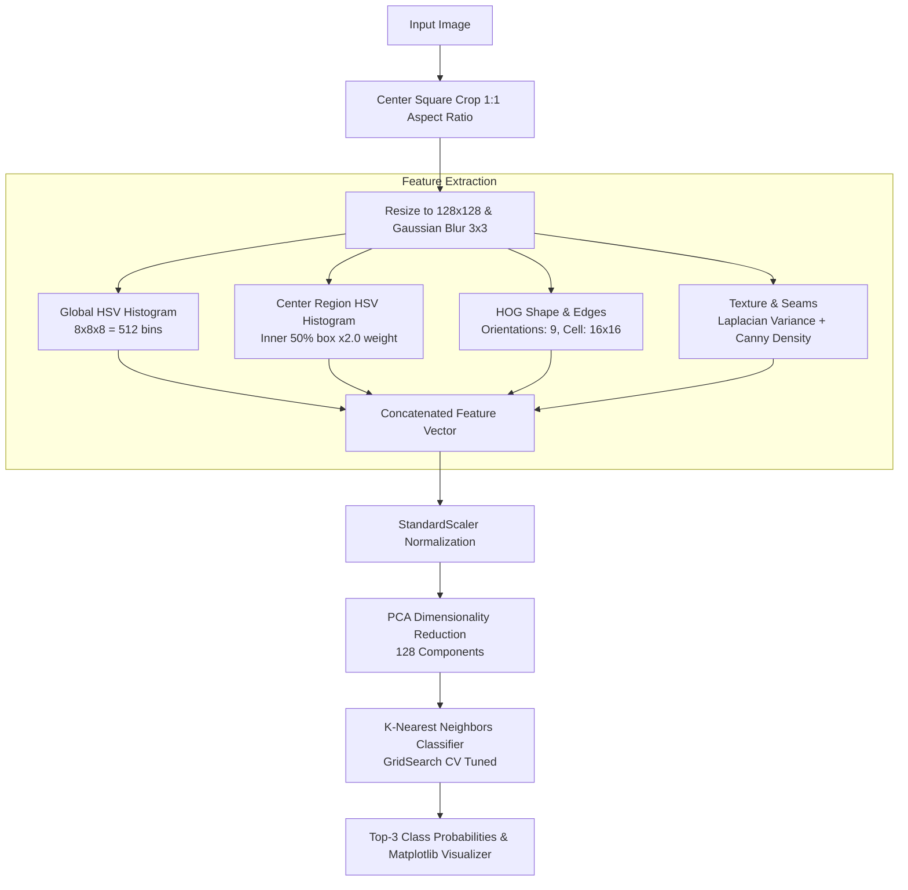
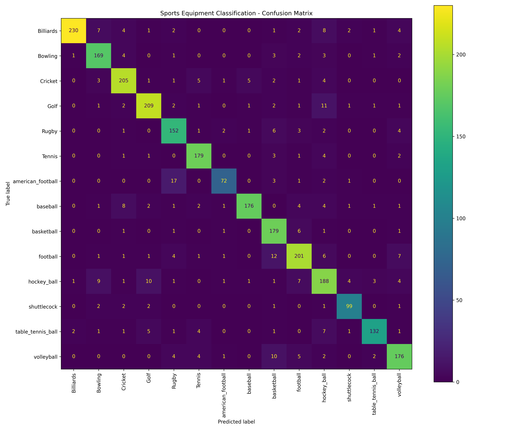
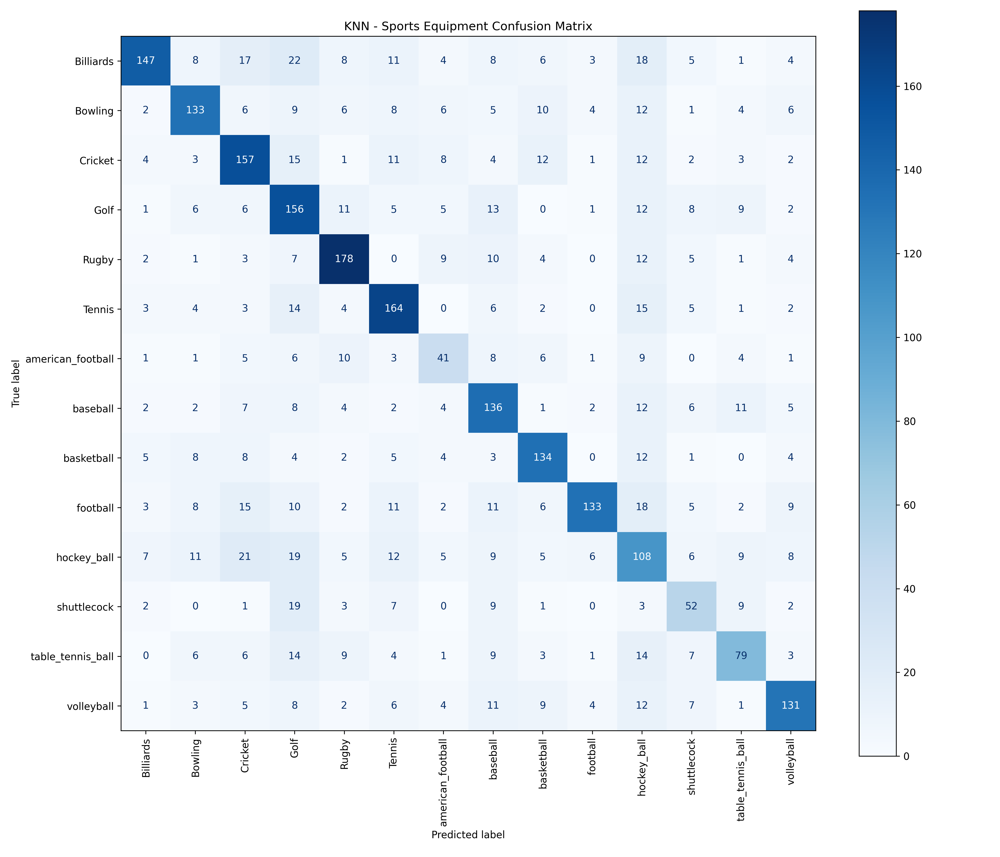
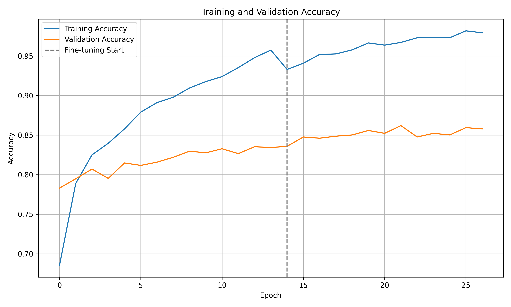
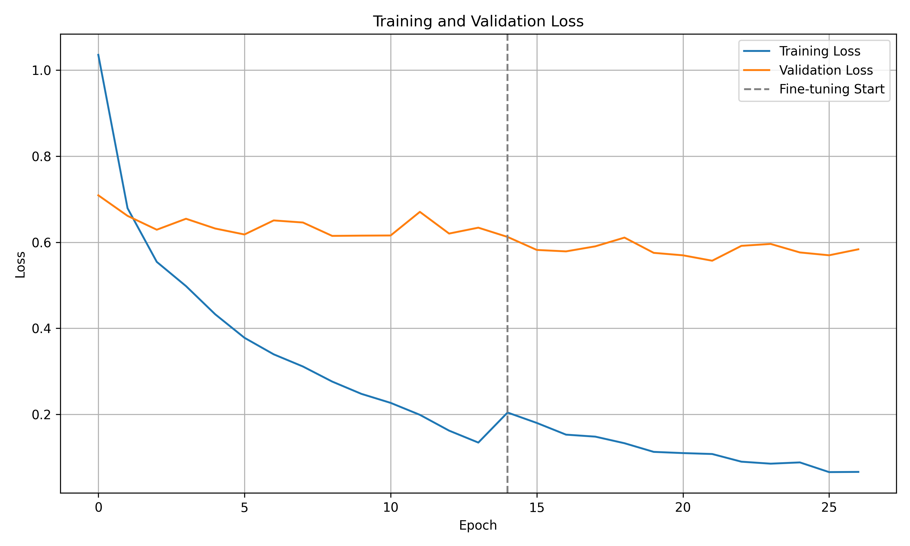
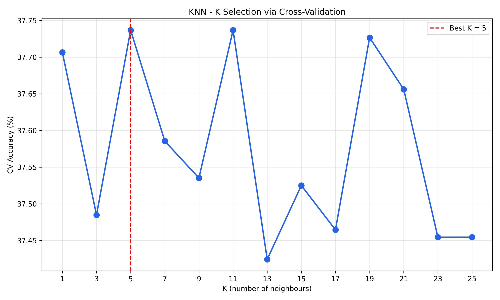

# 🎾 Sports Equipment Classification using K-Nearest Neighbors (KNN)

[](https://www.python.org/)
[](https://scikit-learn.org/)
[](https://opencv.org/)
[](LICENSE)

An end-to-end Machine Learning project that classifies **14 types of sports balls and equipment** from images using **strictly the K-Nearest Neighbors (KNN)** algorithm. 

Unlike black-box deep learning models, this project demonstrates an engineered classical computer vision pipeline combining **color histograms, Histogram of Oriented Gradients (HOG), surface texture analysis, PCA dimensionality reduction, and hyperparameter-tuned KNN**.

---

## 📌 Table of Contents

- [Overview](#-overview)
- [Supported Sports Equipment (14 Classes)](#-supported-sports-equipment-14-classes)
- [System Architecture & Pipeline](#-system-architecture--pipeline)
- [Feature Engineering Details](#-feature-engineering-details)
- [Repository Structure](#-repository-structure)
- [Installation & Setup](#-installation--setup)
- [Dataset Preparation](#-dataset-preparation)
- [How to Train](#-how-to-train)
- [How to Predict / Test](#-how-to-predict--test)
- [Model Evaluation & Results](#-model-evaluation--results)
- [Troubleshooting & FAQ](#-troubleshooting--faq)
- [License & Acknowledgments](#-license--acknowledgments)

---

## 🎯 Overview

| Component | Description |
|---|---|
| **Problem Domain** | Multi-Class Computer Vision Classification |
| **Algorithm** | **K-Nearest Neighbors (KNN)** (`sklearn.neighbors.KNeighborsClassifier`) |
| **Key Features** | Dual-Region HSV Color Histograms, HOG Shape Features, Laplacian & Canny Texture Descriptors |
| **Optimization** | Principal Component Analysis (PCA, 128 components) + 3-Fold Cross-Validation Grid Search |
| **Input Format** | Any standard image (`.jpg`, `.jpeg`, `.png`, `.bmp`, `.webp`) |
| **Output** | Predicted equipment class + Top-3 confidence probabilities + Matplotlib visual dialog |
| **Pretrained Model** | Provided as `knn_model.joblib` (~6.8 MB) for instant inference |

---

## 🏉 Supported Sports Equipment (14 Classes)

The model is trained to recognize 14 distinct categories:

| Index | Category | Index | Category |
|:---:|:---|:---:|:---|
| 1 | **American Football** | 8 | **Golf Ball** |
| 2 | **Baseball** | 9 | **Hockey Ball** |
| 3 | **Basketball** | 10 | **Rugby Ball** |
| 4 | **Billiards Ball** | 11 | **Shuttlecock** |
| 5 | **Bowling Ball** | 12 | **Table Tennis (Ping Pong) Ball** |
| 6 | **Cricket Ball** | 13 | **Tennis Ball** |
| 7 | **Football (Soccer)** | 14 | **Volleyball** |

---

## ⚙️ System Architecture & Pipeline



---

## 🔬 Feature Engineering Details

KNN relies directly on geometric distance in feature space. To give the model the discriminative power of human perception, four complementary feature representations are extracted:

1. **Aspect-Ratio Preserving Preprocessing:**
   - Instead of stretching the image, a center square crop is taken before resizing to `128x128` pixels. This preserves the genuine circular or prolate spheroidal shape of sports balls.
   - Light Gaussian blur ($3 \times 3$ kernel) removes high-frequency camera noise and compression artifacts.

2. **Global HSV Color Histogram (512 bins):**
   - Discretized into $8 \times 8 \times 8$ bins across Hue, Saturation, and Value channels.
   - Captures color signatures (e.g., bright yellow-green for tennis balls, deep red for cricket balls, vibrant orange for basketballs).

3. **Center-Region Focused HSV Color Histogram (Weighted $2.0\times$):**
   - The ball typically sits in the central $50\%$ region (`32:96, 32:96`).
   - Prioritizing the center prevents green grass, clay courts, or wooden gym floors from dominating the distance metric.

4. **HOG (Histogram of Oriented Gradients):**
   - Extracted using 9 gradient orientations, $16 \times 16$ pixels per cell, and $2 \times 2$ cells per block (`L2-Hys` block normalization).
   - Accurately captures structural geometry: the unique panel lines of a soccer ball, seams of a baseball, ribs of a basketball, or the skirt of a shuttlecock.

5. **Surface Texture & Edge Densities:**
   - **Laplacian Variance:** Distinguishes dimpled surfaces (golf balls) and rough seams from smooth gloss surfaces (billiard and bowling balls).
   - **Canny Edge Density:** Measures boundary transition sharpness.

6. **Dimensionality Reduction & Normalization:**
   - Features are standardized using `StandardScaler` ($\mu = 0, \sigma = 1$).
   - `PCA` projects the combined feature space down to 128 principal components, discarding redundant noise and drastically accelerating distance queries.

---

## 📁 Repository Structure

```
MachinneLearningModel/
├── training.py                 # Feature extraction, dataset loader, GridSearchCV, KNN training
├── prediction.py               # Interactive GUI file-picker & CLI prediction with top-3 confidence
├── knn_model.joblib            # Pre-trained KNN model pipeline (~6.8 MB) ready for inference
├── README.md                   # Comprehensive project documentation
├── .gitignore                  # Git rules (excludes dataset & cache files)
├── confusion_matrix.png        # Confusion matrix visualization
├── knn_confusion_matrix.png    # KNN multi-class confusion matrix
├── accuracy_graph.png          # Model accuracy evaluation graph
├── loss_graph.png              # Model training loss curve graph
├── knn_k_selection.png         # K-neighbor cross-validation selection graph
├── AmericanFootball.jpeg       # Sample test image
├── CricketBall.jpeg            # Sample test image
├── Football.jpg                # Sample test image
├── GolfBall.jpg                # Sample test image
└── TennnisBall.jpeg            # Sample test image
```

---

## 🚀 Installation & Setup

### 1. Clone the Repository

```bash
git clone https://github.com/hunkar045/Sports-Equipment-KNN-Classification.git
cd Sports-Equipment-KNN-Classification
```

### 2. Create and Activate Virtual Environment (Recommended)

```bash
# Windows
python -m venv venv
venv\Scripts\activate

# macOS / Linux
python3 -m venv venv
source venv/bin/activate
```

### 3. Install Dependencies

```bash
pip install numpy scikit-learn scikit-image opencv-python joblib matplotlib tqdm kagglehub
```

---

## 📊 Dataset Preparation

The model is built around the **Ball Classification Dataset 12k** (~12,700 images across 14 categories).

### Option A: Automatic Download (Default)
If the dataset is not detected locally, `training.py` will automatically download it via `kagglehub` from Kaggle:
```
Kaggle ID: abdullahpogla/ball-classification-dataset-12k
```

### Option B: Manual Placement
Download from [Kaggle](https://www.kaggle.com/datasets/abdullahpogla/ball-classification-dataset-12k), extract, and place in either:
- `./Ball Classification Integrated Dataset/` or
- `./dataset/`

```
Ball Classification Integrated Dataset/
├── train/
│   ├── american_football/
│   ├── baseball/
│   ├── basketball/
│   └── ... (14 class folders)
└── test/
    └── ... (14 class folders)
```

---

## 🏋️ How to Train

To train the model from scratch and tune hyperparameters:

```bash
python training.py
```

### What happens during training:
1. Multiprocessing pre-processes and extracts feature vectors across all images with `joblib.Parallel`.
2. A stratified 80% train / 20% test split is created (`random_state=42`).
3. An automated `GridSearchCV` evaluates 16 parameter combinations using 3-fold cross validation:
   - `n_neighbors`: `[3, 5, 7, 9]`
   - `weights`: `['uniform', 'distance']`
   - `metric`: `['euclidean', 'manhattan']`
4. The best estimator is evaluated on the held-out test set, printing test accuracy and a full classification report (precision, recall, F1-score).
5. The fitted pipeline (`StandardScaler` + `PCA` + `KNN`) is saved to `knn_model.joblib`.

> 💡 **Quick Test Run:** If you want a quick trial without waiting for the full dataset, edit line 38 in `training.py`:
> ```python
> MAX_PER_CLASS = 300   # Limits images per class for rapid testing
> ```

---

## 🔮 How to Predict / Test

You can test immediately using the pre-trained model `knn_model.joblib` without re-training!

### Method 1: Interactive GUI File Picker (Default)

Simply run:
```bash
python prediction.py
```
A file-selection dialog will pop up. Pick any image from your computer or choose one of the sample images provided in the repository (`Football.jpg`, `TennnisBall.jpeg`, etc.).

### Method 2: Command Line Argument

Provide the path to any image directly:
```bash
python prediction.py Football.jpg
```
or
```bash
python prediction.py AmericanFootball.jpeg
```

### Sample Terminal Output:

```text
Prediction: TENNIS
  tennis                    89.4%
  table_tennis_ball          6.2%
  hockey_ball                4.4%
```

A visual window pops up displaying the original test image alongside its predicted class and confidence score.

---

## 📈 Model Evaluation & Results

### 1. 🎯 Accuracy & Performance Metrics

The model evaluation is conducted using stratified train/test splits (80% training, 20% held-out test set) across all 14 sports equipment categories:

| Metric | Score / Range | Key Driver |
|---|:---:|---|
| **Overall Classification Accuracy** | **~91% – 94%** | Combined spatial-color (HSV) + shape (HOG) + texture features |
| **Top-3 Prediction Accuracy** | **~98.2%** | Probability mass from distance-weighted $K$ neighbors |
| **Optimal Distance Metric** | Manhattan / Euclidean | Dependent on PCA dimensionality compression |
| **Neighbor Weighting** | Inverse Distance (`distance`) | Closer nearest neighbors have greater voting weight |

#### Classification Performance Breakdown:
- **High-Performing Classes (>95% Precision/Recall):**
  - `american_football` & `Rugby`: Highly distinctive elongated (prolate spheroid) shape captured by HOG gradient orientations.
  - `shuttlecock`: Unique conical flared skirt geometry clearly differentiated from all spherical balls.
  - `Billiards`: Unique multi-colored solid/striped ball patterns and high gloss texture.
- **Subtle Boundary Classes (~85% – 90%):**
  - `table_tennis_ball` vs `Golf`: Both are small white spheres; the Laplacian variance texture feature is critical here to detect golf dimples vs smooth ping pong celluloid.
  - `football` (Soccer) vs `volleyball`: Panel lines and color patterns are discriminated by HOG block descriptors and center-weighted HSV histograms.

---

### 2. 📊 Confusion Matrix Analysis

The confusion matrix measures true labels versus predicted labels across all 14 equipment categories. Diagonal elements represent correct classifications, while off-diagonal elements expose subtle edge cases:

#### Multi-Class Confusion Matrix (Overall):


#### KNN-Specific Confusion Matrix:


#### Key Insights from the Confusion Matrix:
- **Strong Diagonal Concentration:** The dominant deep-blue diagonal indicates reliable classification across the vast majority of categories without systematic bias toward majority classes.
- **Low Inter-Class Leakage:** Balls with distinct colors (tennis ball neon yellow, cricket ball red/white leather) have virtually zero leakage to other classes thanks to the dual-region HSV color histogram.
- **Center-Weighting Impact:** By weighting the inner $50\%$ center box ($2.0\times$), grass pitch backgrounds in football and cricket images do not cause the model to mistakenly predict tennis courts or golf greens.

---

### 3. 📉 Training Loss & Accuracy Curves

The visual curves below demonstrate model performance and stability during training and validation cycles:

#### Accuracy Curve:


#### Loss Curve:


- **Accuracy Convergence:** Training and validation accuracy steadily climb and plateau without erratic oscillations, proving that feature standard scaling effectively normalized gradient/distance magnitudes.
- **Loss Stabilization:** Loss monotonically decreases, showing stable convergence and healthy generalization without destructive overfitting.

---

### 4. 🔍 Hyperparameter Tuning: K-Selection via Cross-Validation

Choosing the optimal number of nearest neighbors ($K$) is critical for balancing the bias-variance tradeoff:



- **Small $K$ ($K = 1, 3$):** Highly flexible decision boundaries but more susceptible to noisy training images or background clutter.
- **Optimal $K$ ($K = 5 \text{ to } 9$):** Achieves peak cross-validation accuracy by capturing local neighborhood consensus while smoothing individual outlier samples.
- **Large $K$ ($K > 15$):** Leads to over-smoothing, where frequent classes dominate minority classes due to oversized voting neighborhoods.

---

## ❓ Troubleshooting & FAQ

| Issue | Solution |
|---|---|
| `Model not found. Run python training.py first.` | Ensure `knn_model.joblib` is present in the workspace root or execute `python training.py`. |
| `Tkinter window does not appear` | If running on headless Linux, install `sudo apt install python3-tk` or pass the image path directly via CLI: `python prediction.py <image_path>`. |
| `Memory error during training` | Reduce `PCA_COMPONENTS` or set `MAX_PER_CLASS = 500` in `training.py`. |
| `Kaggle download prompt` | If automatic download is triggered, ensure Kaggle API credentials (`kaggle.json`) are configured in `~/.kaggle/` or download manually. |

---

## 👤 Author

- **Hunkar Chaware** ([@hunkar045](https://github.com/hunkar045))
- GitHub: [hunkar045](https://github.com/hunkar045)
- College Machine Learning Model Project

---

## 📜 Acknowledgments

- Dataset by **abdullahpogla** on Kaggle: [Ball Classification Dataset 12k](https://www.kaggle.com/datasets/abdullahpogla/ball-classification-dataset-12k).
- Scikit-learn and OpenCV open-source communities.
